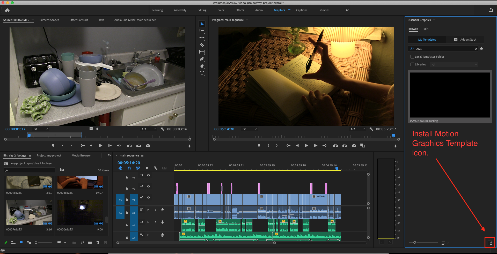

# Opening a JAMS Text Template

1. If you haven't already done so, [download a JAMS Text Template](downloading-the-jams-text-template-to-your-project-folder.md) to your project folder.
2. Click the **Workspaces** button (upper-right corner) and select **Captions and Graphics**. The **Essential Graphics** panel will open on the right.
3. In the **Essential Graphics** panel, make sure the **Browse** tab is selected. Click the **Install Motion Graphics Template** icon (lower-right corner—see image below.)
4. In the **Open** box, navigate to and select a JAMS Text Template MOGRT file. Click **Open**. The JAMS Text Template will appear in the **Essential Graphics** panel.&#x20;

