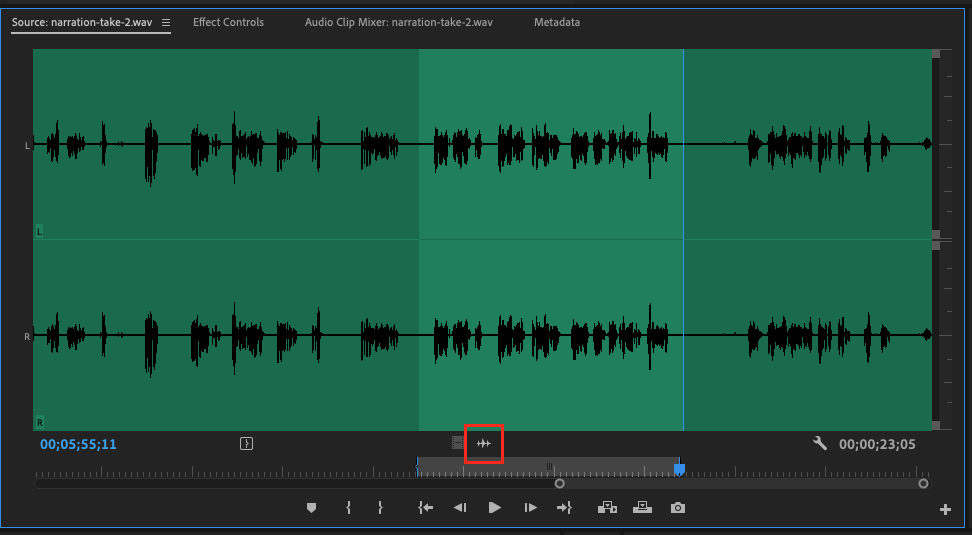

# Adding an audio clip to your sequence

1. Locate the audio file in the Project panel.
2. Click and drag the audio file from the Project panel into your sequence. Note: Audio files go in the audio tracks of a sequence \(A1, A2, etc.\)

