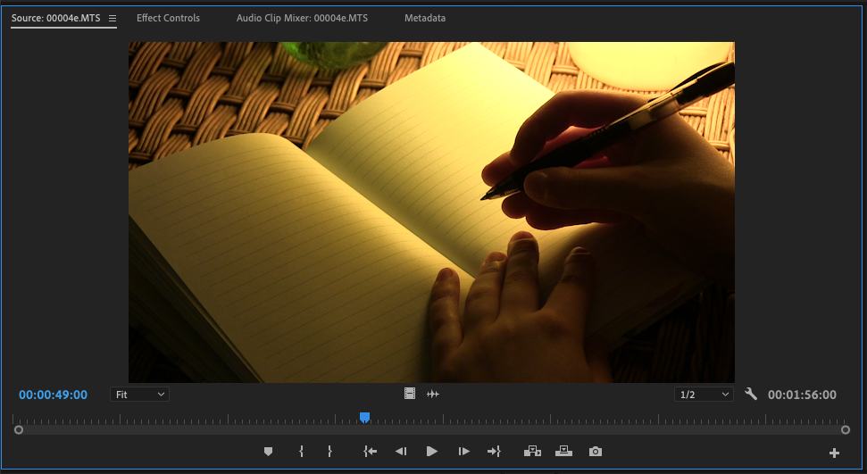

# Previewing clips in the Source monitor

The Source monitor allows you to preview the media files.

1. In the Project panel, double-click a media file. The media file will open in the Source monitor.
2. To play a media file in the Source monitor, make sure the Source monitor window is selected. Then press the **spacebar** on your keyboard.

