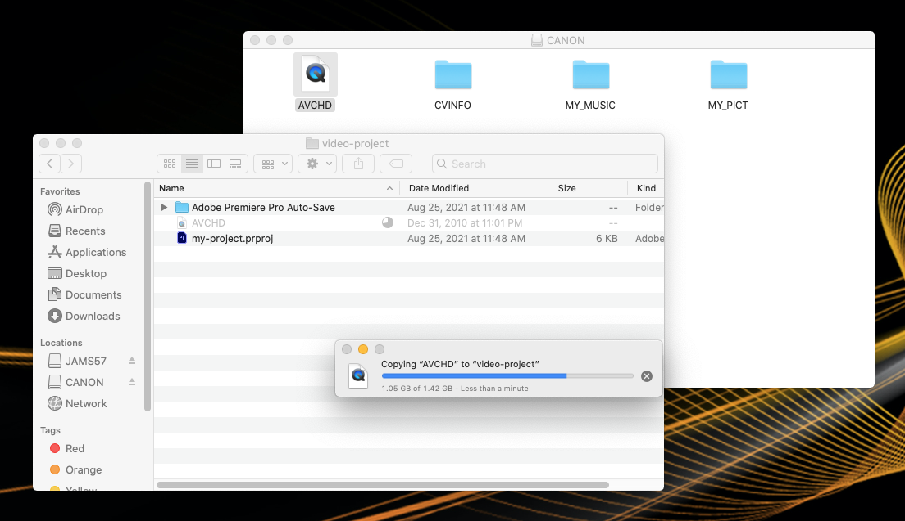

# Copying media files from a Canon video camera into your project folder

Before importing media files into Premiere, you'll need copy these files into your project folder. **Note**: Be sure to follow the instructions for the correct camera (**XA10** or **XA11**.)

### Canon Vixia XA10

1. [Connect your project folder SD card](connecting-your-project-folder-sd-card.md) to the back of a Mac.
2. Connect the video camera to the Mac using the USB cable. (The USB miniport on the camera is under flap under hand flap.)
3. Turn the video camera on.
4. On video camera, open the side panel.
5. Press **Camera to Play** button.
6. On the camera's touch screen, press **Built-in Mem**. (Do not disconnect or turn off the camera without properly ejecting it from the Mac.)
7. Navigate to your project folder in a Finder window. Then [open a second Finder window](https://jjloomis.gitbooks.io/file-and-folder-management/content/opening-multiple-finder-windows.html). Select **Canon** in the left pane of the Finder window.
8. Copy **AVCHD** from the **Canon Finder** window into your project folder.
9. After **AVCHD** has copied into your project folder, eject the video camera. **Control-click** the video camera icon on the **Desktop** and choose **Eject**.
10. Disconnect the camera from the Mac.
11. In your project folder, rename **AVCHD**. Follow [JAMS file and folder naming conventions](https://jjloomis.gitbook.io/file-and-folder-management-mac-os-edition/file-and-folder-naming-conventions).&#x20;
12. [Rename your MTS files](previewing-and-renaming-clips-in-finder.md).

### Canon Vixia XA11

1. [Connect your project folder SD card](connecting-your-project-folder-sd-card.md) to the back of a Mac.
2. Connect the video camera to the Mac using the USB cable. (The USB miniport on the camera is under the front flap.) **Note**: Do not remove the SD card from the camera.
3. On the camera, set the **CAMERA/OFF/MEDIA** switch to **MEDIA**.&#x20;
4. On the camera, open the side panel.
5. On the touch screen, tap **Mem. Card A**.
6. [Navigate to your project folder](https://jjloomis.gitbook.io/file-and-folder-management-mac-os-edition/navigating-folder-tree) in a Finder window. Then [open a second Finder window](https://jjloomis.gitbook.io/file-and-folder-management-mac-os-edition/opening-multiple-finder-windows). Select **Canon** in the left pane of the Finder window.&#x20;
7. Double click the **PRIVATE** folder.&#x20;
8. Copy the **AVCHD** folder into your project folder.&#x20;
9. After **AVCHD** has copied into your project folder, eject the video camera.&#x20;
10. Disconnect the camera from the Mac.
11. In your project folder, rename **AVCHD**. Follow [JAMS file and folder naming conventions](https://jjloomis.gitbook.io/file-and-folder-management-mac-os-edition/file-and-folder-naming-conventions).
12. [Rename your MTS files](previewing-and-renaming-clips-in-finder.md).&#x20;

