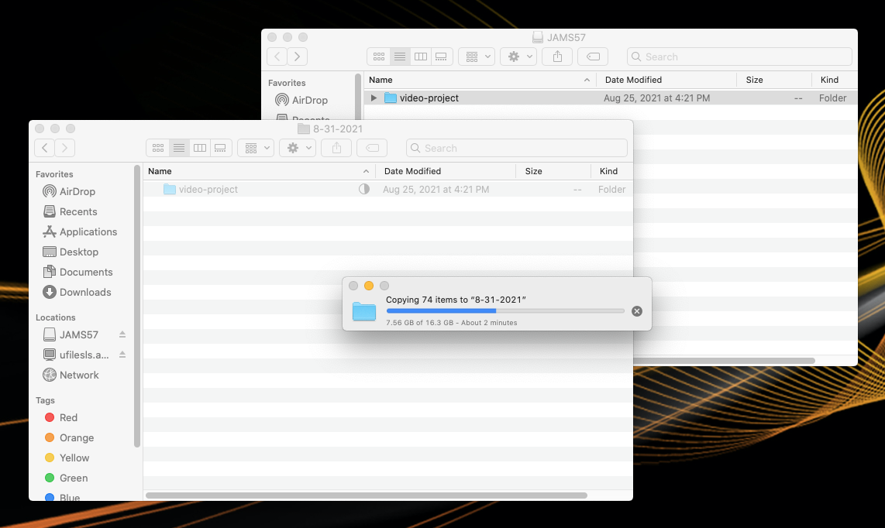

# Backing up your project folder

Be sure to backup your project folder on a regular basis. If anything happens to your project folder SD card, you'll have a backup version in your class folder. 

1. Go the [JAMS Tech Resources for Students](http://uwm.edu/journalism-advertising-media-studies/student-resources/tech-resources/) page. 
2. Click the **Click here to connect to your class folder in a CCL** link (upper-right.)
3. Your browser will ask if you would like to proceed. Click the affirmative option (**Open Finder**, **Yes**, **Launch Application**, etc.)
4. A dialog box will appear. Click **Connect**. 
5. In the **Finder window**, double-click your **course number folder** and your **Lastname-Firstname** **folder** to navigate into your **class folder**. 
6. In you **class folder,** create a new folder using today's date as its name using this format: 3-8-2021. **Note**: Do not use slashes in the folder name.
7. With the **Finder window** still selected, press **Command N** (on keyboard) to open a second **Finder window**.
8. In the second **Finder window**, select your **project folder SD card** (under **Locations** on left.) Your **project folder SD card** will be named **JAMS** followed by a number. 
9. Click and drag your project folder from your **project folder SD** **card** into the folder you created in Step 6. **Important**: Make sure you click and drag the project from your **project folder SD card** into the folder you created in Step 6 (not the other way around.)

