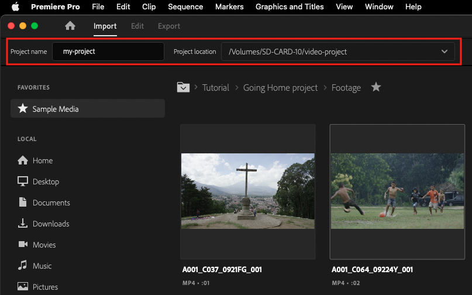

# Creating a Premiere project

1. [Connect your project folder SD card](connecting-your-project-folder-sd-card.md) to the back of a Mac.
2. In Premiere, click **File** on the menu bar. Choose **New** and select **Project**.
3. In the **New Project** dialog box, click the **Browse** button. A **Finder window** will appear.
4. In the **Finder window**, navigate to your project folder. Click **Choose**.
5. In the **New Project** dialog box, give your project a name. Follow [JAMS file and folder naming conventions](https://jjloomis.gitbook.io/file-and-folder-management/file-and-folder-naming-conventions).
6. When finished, click **OK**.

**Note**: By default, Scratch Discs are set to reside in the same location as your PRPROJ file. Scratch Disc locations should not be changed.

