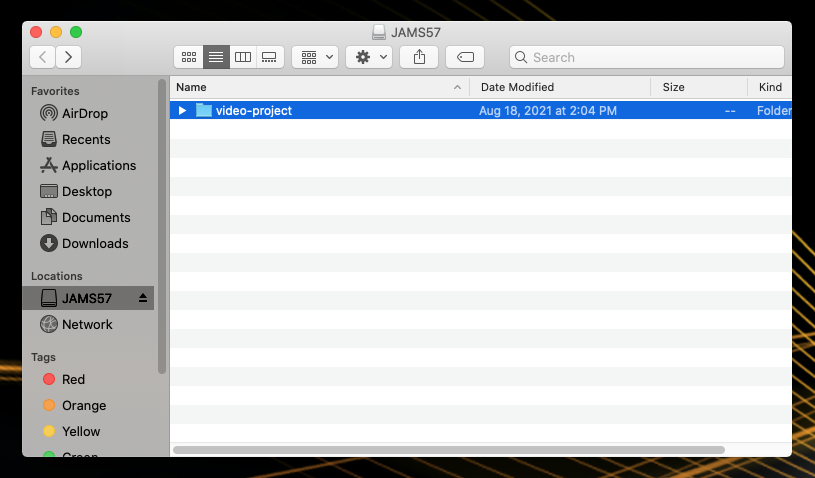

# Creating a project folder

Before starting a Premiere project, you'll need to create a project folder. All media files associated with your project will live in this project folder along with your Premiere project file \(PRPROJ.\)

Never rename, move or delete the media files in your project folder. Your PRPROJ file references these files. If your PRPROJ file can't locate a media file, it will appear offline in your project.

1. [Connect your project folder SD card](connecting-your-project-folder-sd-card.md) to the back of a Mac.
2. Navigate to your project folder SD card in a **Finder** window. \(**Note**: To bring up a new **Finder** window, click the **Desktop** and then press **Command N** on the keyboard.\)
3. Control-click in the project folder SD card **Finder** window. In the fly-out menu, select **New Folder**.
4. Give this folder a new name. Follow [file and folder naming conventions](https://jjloomis.gitbooks.io/file-and-folder-management/content/file-and-folder-naming-conventions.html).

