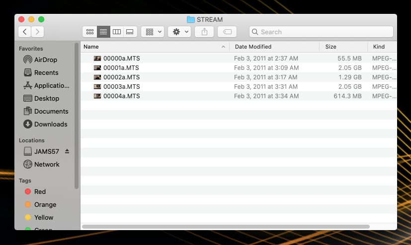

# Renaming MTS files

1. If you haven't already done so, copy the media files on your device (Canon video camera, iPhone, Zoom, etc.) into your project folder.&#x20;
2. Disconnect the device and navigate to the media files in your project folder. **Note**: To navigate to media files from a Canon video camera, you'll need to do the following:
   * Go into your **renamed AVCHD** folder (see [Copying media files from a Canon video camera](adding-media-from-a-video-camera.md) if you haven't renamed this folder.)
   * In your **renamed AVCHD** folder, you'll see two folders (**BDMV** and **Canon**.) Control-click the **BDMV** folder. In the fly-out menu, select **Show Package Contents**.
   * In the **BDMV** folder, you'll see several folders. Double-click **STREAM**. The files in this folder are your media files (00000.MTS, etc.)
3. Rename all of the MTS files in the **STREAM** folder. Do this by adding a letter to the end of the default filename (for example, 0000.MTS becomes 0000a.MTS.) Use the same letter for all of the MTS files (see image below.) Do not use a letter used in a previous project. **Note**: Be sure to maintain the .MTS extension at the end of the filename.

