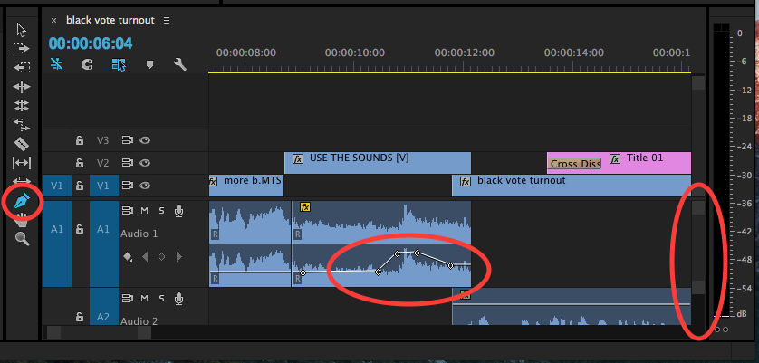

# Automating clip volume with keyframes

Specific areas of your clips can be set to automatically become louder or softer in volume as your project plays in theTimeline. This automation process is not always necessary, but it is an option if want to create dynamic volume fluctuations at specific points in your project.

To automate the volume of an audio track, you can use the Pen Tool to add keyframes to your clips in theTimeline. The keyframes will automatically increase or decrease the volume of the sound bites as your project plays.

1. In the Tools panel, select the Pen Tool.
2. If necessary, expand the visible area of the audio track section in the Timeline. Click and drag the audio track height slider handles \(on the right side of the audio track area in Timeline.\) You will see waveforms in the audio portions of your clips. 
3. Using the Pen Tool, click the horizontal white line that runs though the middle of the clip you'd like to edit. A keyframe \(small circle\) will appear on the white line.
4. Click the horizontal white line to add more keyframes to your clip. \(Generally, audio automation only requires three or four keyframes.\)
5. Using the Pen Tool, keyframes can be moved up or down \(to adjust clip volume\) or left to right \(to adjust the point at which the volume changes begin or end.\) 
6. To delete a keyframe, select it using the Pen Tool \(the keyframe will appear blue.\) Press the Delete key on your keyboard.
7. When finished, switch back to the Selection Tool in the Tools panel.

