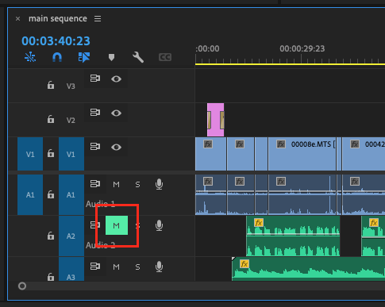

# Using mute and solo controls

* To mute the audio of a track in the Timeline, click the **M** \(mute\) button in the audio track controls.
* To play the audio from only one track in the Timeline, click the **S** \(solo\) button in the audio track controls.

